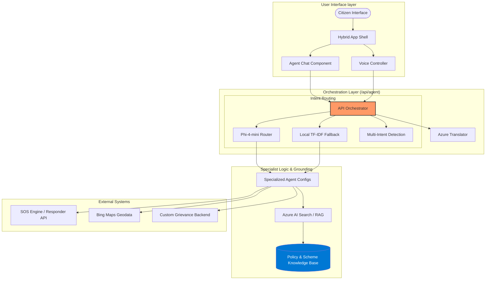

# Bharat Setu — Bridging the Digital Divide with Agentic Governance

<div align="center">


[](https://nextjs.org)
[](https://react.dev)
[](https://www.typescriptlang.org)
[](https://azure.microsoft.com)
[](https://github.com/marketplace/models)

**A multilingual, agentic governance platform simplifying public service access through specialized AI orchestration.**  
*Intuitive Specialist Routing · RAG-Grounded Answers · Multilingual Voice Access · Emergency SOS Orchestration*

</div>

---

## 📖 Table of Contents

1. [Overview](#-overview)
2. [The Agent Council](#-the-agent-council)
3. [System Architecture](#-system-architecture)
4. [Core Features](#-core-features)
5. [Tech Stack](#-tech-stack)
6. [Getting Started](#-getting-started)
7. [Environment Configuration](#-environment-configuration)
8. [API Reference](#-api-reference)

---

## 🌟 Overview

**Bharat Setu** is an agentic platform designed to bridge the gap between complex government bureaucracy and the everyday citizen. Instead of navigating a maze of departments and forms, citizens interact with a natural language interface (Voice or Chat) that intelligently routes their needs to specialized experts.

The platform uses a **Council-based Orchestration** model, where a central controller identifies user intent and hands off the conversation to specialized agents grounded in official policy records via Retrieval-Augmented Generation (RAG).

---

## 🧠 The Agent Council

The heart of Bharat Setu is its council of five specialized agents, each an expert in a critical domain of governance.

```mermaid
mindmap
  root((Bharat Setu Council))
    Nagarik Mitra
      "Civic & Municipal Services"
      "Roads & Infrastructure"
      "Waste & Sanitation"
      "Grievance Tracking"
    Swasthya Sahayak
      "Medical Guidance"
      "Emergency Protocols"
      "Ayushman Bharat / ABHA"
      "Nearest PHC Lookup"
    Yojana Saathi
      "Scheme Enrollment"
      "Eligibility Assessment"
      "PDS / Ration Support"
      "Benefit Distribution"
    Arthik Salahkar
      "Banking & Digital Finance"
      "Fraud & Scam Prevention"
      "Loan/Mudra Guidance"
      "Financial Literacy"
    Vidhi Sahayak
      "Legal Rights & FIR Advice"
      "Free Legal Aid (NALSA)"
      "RTI & CPGRAMS Filing"
      "Domain-Specific Remedies"
```

---

## 🏗️ System Architecture

Bharat Setu follows a modular, serverless-first architecture optimized for low-latency routing and high-confidence policy grounding.



---

## ✨ Core Features

### 🏢 Scheme Tracker (formerly Bureaucracy X-Ray)
A specialized workspace for navigating complex administrative requirements.
- **Intelligent Intake**: Detects the specific government form or scheme needed.
- **Interactive Forms**: Direct integration with **RTI** and **CPGRAMS** workflows through pre-filled, empathetic form modals.
- **Step-by-Step Guidance**: Breaks down complex legal procedures into citizen-friendly actions.

### 🔄 Multi-Intent Routing
Handles compound queries seamlessly. If a user states: *"I'm not feeling well and I need legal help"*, the system:
1.  Maintains the conversation with the current specialist (e.g., Health).
2.  Provides an empathetic response to the primary concern.
3.  Injects a **suggested handoff** to the secondary specialist (e.g., Legal).
4.  Relaxes RAG requirements to ensure no conversational input is met with a "no record found" fallback.

### 🎙️ Multilingual Voice Access
- Supporting **22 Indian languages** for profile setup and interaction.
- Azure Speech-backed Speech-to-Text (STT) and Text-to-Speech (TTS).
- Real-time translation enabling cross-lingual council expertise.

### 🚨 Emergency SOS Stack
- **Protocol Activation**: Triggered via dashboard or high-urgency keywords.
- **Responder Fan-out**: Geolocation-aware notifications via Fast2SMS.
- **Live Location Tracking**: Real-time updates via DIGIPIN integration.

---

## 🛠️ Tech Stack

- **Frontend**: Next.js 14 (App Router), React 18, Tailwind CSS, Framer Motion.
- **State Management**: Zustand.
- **AI/LLM**: 
  - **Primary**: Azure OpenAI (GPT-4o) for response generation.
  - **Routing**: Phi-4-mini (via GitHub Models) for high-speed intent classification.
- **Search**: Azure AI Search (Vector + Semantic) for grounded RAG.
- **Infrastructure**: Vercel (Frontend), Railway (VDB / Backend Services).

---

## 🚀 Getting Started

### Prerequisites
- Node.js 20+
- npm

### Installation
```bash
git clone https://github.com/ranjan-arnav/bharat_setu.git
cd bharat_setu
npm install
```

### Development
```bash
npm run dev
```

---

## ⚙️ Environment Configuration

Create a `.env.local` file with the following essential keys:

```env
# AI & Search
AZURE_OPENAI_API_KEY=
AZURE_OPENAI_ENDPOINT=
AZURE_SEARCH_ENDPOINT=
AZURE_SEARCH_KEY=
AZURE_SEARCH_INDEX=bharat-setu-index

# Translation & Speech
AZURE_TRANSLATOR_KEY=
AZURE_TRANSLATOR_REGION=
AZURE_SPEECH_KEY=
AZURE_SPEECH_REGION=

# Orchestration
GITHUB_TOKEN= # For Phi-4 Routing
NER_SERVICE_URL= # Railway Backend
```

---

## 🔌 API Reference

| Endpoint | Method | Description |
| :--- | :--- | :--- |
| `/api/agent` | `POST` | The central orchestrator for intent routing and specialist responses. |
| `/api/schemes` | `POST` | Policy search and scheme matching with RAG grounding. |
| `/api/grievance` | `POST` | Direct filing of civic grievances with automated domain assignment. |
| `/api/sos` | `POST` | Emergency workflow management and responder notification. |
| `/api/stt` / `/api/voice` | `POST` | Voice interaction layer (Speech-to-Text and Text-to-Speech). |

---

<div align="center">

**Bharat Setu**  
*Empowering citizens through human-centric, agentic technology.*

</div>
