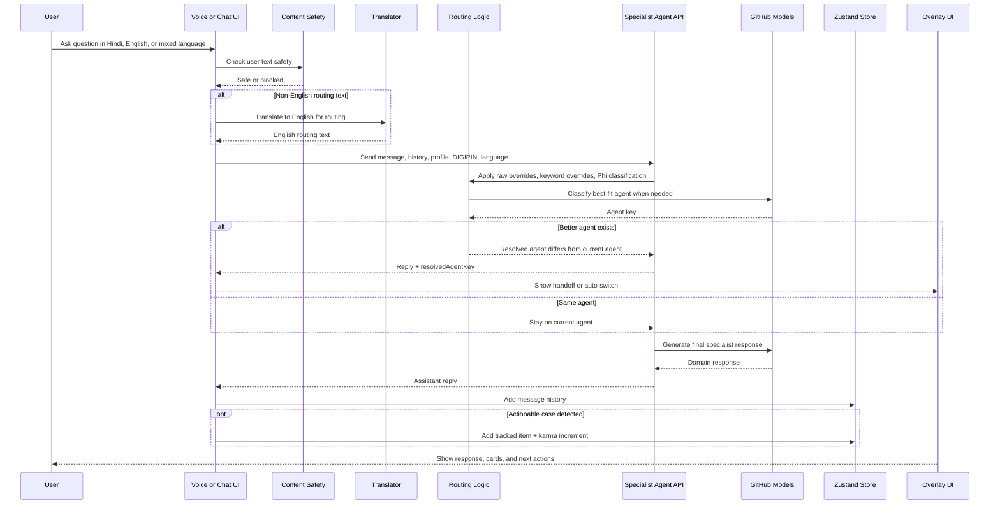

# Bharat Setu

**Bridging the Digital Divide with Agentic Governance**

Bharat Setu is a multilingual, mobile-first digital governance platform designed for Indian citizens who are still excluded by language-heavy, fragmented, and form-centric public service experiences. The system combines a government-facing service layer, a citizen-friendly conversational layer, and an emergency response layer inside a single Next.js application. Instead of forcing users to understand which portal, department, or workflow they need, Bharat Setu accepts natural speech or text, routes the query to the right specialist agent, and helps the user act.

This repository is not a concept-only prototype. It contains a working app shell, onboarding flow, multilingual agent chat, grievance filing, scheme matching, DIGIPIN tooling, emergency SOS orchestration, tracking overlays, safety checks, voice support, and deployment configuration for Docker and Netlify. The codebase is structured so that the static stitched screens provide fast, visually rich surfaces while the TypeScript overlay system handles high-trust workflows, live orchestration, and integration logic.

For a Microsoft hackathon context, the most important point is this: Bharat Setu is an implementation-first interpretation of “AI for India.” It targets real barriers such as vernacular accessibility, entitlement discovery, civic complaint friction, emergency escalation, and the inability to navigate government systems confidently. The product narrative is ambitious, but the README below stays grounded in what is actually implemented in the repository.

## Problem, Innovation, and Impact

### The problem

India’s digital public infrastructure is strong at the systems layer, but access remains weak at the experience layer. For a large segment of users, especially in tier 2, tier 3, tier 4, and rural contexts, public services still feel fragmented, intimidating, and linguistically exclusionary. The real-world problem is not merely “internet access.” It is the continued gap between having a phone and being able to successfully navigate a state workflow.

In practice, that gap shows up in several ways:

- a user knows they need help, but not which department or portal is responsible
- a user can speak naturally, but cannot comfortably fill dense, English-first forms
- a user may qualify for a scheme, but gives up before discovering or applying for it
- a user can report a grievance, but cannot track it confidently afterward
- a user in distress may need a fast escalation path rather than a static contact directory

Bharat Setu is designed around that friction. The app does not assume citizens will understand government system structure. Instead, it tries to understand the citizen’s intent and then map that intent to the correct workflow, specialist, or escalation channel.

### The innovation

The novelty of Bharat Setu is not a single model or a single UI trick. It is the way multiple layers are combined into a coherent governance interface:

- a multilingual conversational layer for natural intent capture
- a specialist routing layer that distinguishes civic, health, welfare, finance, and legal journeys
- a DIGIPIN-aware location layer for hyperlocal civic and emergency context
- a workflow layer that converts chat into trackable action rather than leaving the interaction as advice only
- a resilient fallback architecture so the product remains demoable and usable even under quota, provider, or connectivity constraints

From a product standpoint, the strongest innovation is that Bharat Setu is not built as a generic chatbot. It is built as an orchestration surface for public-service outcomes. The interface is conversational, but the underlying goal is operational: route, guide, record, escalate, and track.

### The impact thesis

If extended into a production-grade system, Bharat Setu could reduce the “cognitive tax” that currently blocks public-service access for millions of users. Even in its present repository form, the product demonstrates a credible impact model:

- faster access to the correct service domain through AI routing
- better scheme discoverability through profile-based matching
- improved grievance quality via photo analysis, category support, and structured ticket generation
- more trustworthy emergency escalation via multi-responder SOS orchestration
- stronger user retention through tracking, visibility, and civic karma loops

In short, Bharat Setu’s impact claim is that governance becomes more inclusive when the interface adapts to the citizen, not when the citizen is forced to adapt to the bureaucracy.

---

## 1. Vision

India has excellent digital public infrastructure, but access is still uneven because the interface to the state remains cognitively expensive. A user may know what problem they have, but not which portal, department, certificate, form, or escalation path they need. Bharat Setu addresses that gap by shifting the burden of system navigation from the citizen to an AI-guided orchestration layer.

The platform is built around five domain specialists:

- **Nagarik Mitra** for civic and municipal workflows
- **Swasthya Sahayak** for health guidance and public health access
- **Yojana Saathi** for schemes, benefits, eligibility, and entitlements
- **Arthik Salahkar** for financial literacy, banking, and fraud support
- **Vidhi Sahayak** for legal rights, FIR guidance, and basic legal pathways

Those agents are not exposed as abstract LLM personas. In the app, they are embedded into concrete user journeys: issue reporting, scheme scanning, scam awareness, SOS escalation, profile-based recommendations, and case tracking. Routing is multilingual and layered. The UI is optimized for mobile usage. And the architecture deliberately mixes static surfaces with dynamic overlays to keep the experience fast and modular.

---

## 2. What This Repository Actually Implements

The codebase delivers the following product capabilities today:

### Multilingual onboarding and citizen profile seeding

The app starts with a full-screen onboarding flow that supports 22 scheduled Indian languages. Users can select their language, proceed through a simulated sign-in and Aadhaar-style verification journey, and choose one of several realistic personas. Onboarding creates both a lightweight working profile and a richer citizen profile containing state, district, DIGIPIN, occupation, income, scheme links, and emergency contacts.

This is important architecturally because nearly every major module reads from the same shared profile state. Scheme matching uses occupation and income. The impact dashboard reads contribution and karma data. The iframe screens receive direct DOM injection and postMessage updates based on the profile. Voice and chat use the preferred language. SOS uses emergency contacts and profile data to enrich alerts.

### A hybrid application shell

The main app page is a Next.js client component that does three jobs at once:

1. It renders the government-branded shell, top bar, and bottom navigation.
2. It loads stitched HTML screens through an iframe-based screen registry.
3. It launches TypeScript overlays for workflows that require richer logic or tighter state integration.

This means Bharat Setu is not “just a Next.js page.” It is a hybrid shell where the static screens provide the visual surfaces for areas such as home, civic, finance, welfare, health, community, and karma, while overlays such as chat, voice, grievance filing, scheme scanning, DIGIPIN lookup, track cases, emergency contacts, and SOS remain fully reactive, stateful React components.

### A bridge between static HTML screens and the React app

The iframe architecture is made possible by an injected bridge script. The parent app injects CSS and a bridge script into each same-origin iframe. That bridge listens for clicks on buttons, cards, bottom nav items, and feature triggers, then relays events to the parent through `postMessage`. The parent app then opens overlays, switches screens, injects live citizen data, syncs theme state, and updates DOM nodes inside the iframe where needed.

This is one of the codebase’s defining patterns. It allows the project to combine stitched or static screen artifacts with a real app runtime rather than treating those screens as isolated mockups.

### Specialist agent chat with routing and handoff

The `AgentChat` overlay is the conversational core of Bharat Setu. It supports:

- per-agent chat histories
- multilingual welcome messages
- image attachment and image analysis
- content safety checks before generation
- translation before routing when the input is not English
- client-side keyword routing
- server-side routing validation with GitHub Models
- explicit handoff suggestions between agents
- auto-tracking of actionable conversations into the Track area
- Azure TTS playback of responses

The chat system is not a single generic “assistant.” It is a controlled specialist interface where every response is anchored to a selected role and a domain-specific system prompt.

### Scheme DNA Scanner

The Scheme Scanner is a guided overlay that simulates a profile scan, then queries `/api/schemes` using the user’s occupation, state, and income. When Azure AI Search is configured, it uses a search index; when it is not, it falls back gracefully to demo scheme data bundled in the repo.

The scanner does not simply show static cards. It computes or fills match scores, displays benefit summaries, shows required documents, and launches a guided application conversation by closing the scanner and dispatching a custom event that opens `Yojana Saathi` with a scheme-specific starter prompt.

### Grievance filing with AI-assisted enrichment

The grievance form is a complete workflow that supports:

- category selection
- optional image upload
- DIGIPIN-aware filing context
- staged analysis UI
- Azure Vision image analysis when configured
- Azure Content Safety moderation for text inputs
- Phi-based or rule-based ticket routing detail generation
- grievance persistence in client state
- automatic creation of a tracked case entry
- karma updates through tracked items

If cloud services are unavailable, the flow still works in a demo-safe fallback mode. That is a recurring pattern across the repository: cloud enhancement when configured, user-safe fallback when not.

### Voice-first access

The voice overlay supports speech recognition across a wide range of Indian languages and maps unsupported browser STT languages to practical alternatives. It performs intent scoring locally based on keyword groups and can also use server-side classification. Once a best-fit agent is detected, it counts down and opens the correct agent chat with the transcript injected.

The voice route on the backend handles Azure Speech token issuance for client STT as well as server-side TTS generation, with language-specific Indian neural voice selection for supported languages.

### DIGIPIN utility layer

The product contains two DIGIPIN-related implementations:

- a browser utility overlay that encodes and decodes DIGIPIN values using an India-bounds grid algorithm
- an SOS-specific DIGIPIN encoder in the shared emergency engine

The DIGIPIN Locator can detect the user’s location via the browser Geolocation API, compute a code, store it in the shared profile, copy it to clipboard, share it externally, and also reverse-lookup a sample or typed code back to a coordinate center.

### Emergency SOS orchestration

The SOS subsystem is one of the most sophisticated parts of the repo. It contains:

- a hold-to-trigger interface to prevent accidental activation
- optional voice-based distress keyword detection
- configurable safety timer activation
- GPS capture and DIGIPIN encoding
- contextual classification for women’s safety, child safety, cybercrime, and disaster response
- dynamic responder list generation
- asynchronous fan-out dispatch
- live status polling
- location update batching and offline queueing
- session cleanup on completion
- SMS alerting through Fast2SMS
- a tracking page for live SOS sessions

The SOS flow is intentionally designed as a real system, not a visual stub. It uses multiple API endpoints, in-memory caches, batched location updates, and responder-specific dispatch behavior.

### Impact, community, and profile management

The `ImpactDashboard` overlay combines platform demo metrics with user-derived live metrics from the store. It includes overview, trends, agent usage, trust, pulse, and profile tabs. The recently added profile tab gives users a direct way to edit name, state, occupation, and income inside the TSX overlay and write those changes back into the central Zustand store.

This area is important because it ties together participation data, case tracking, karma, and user personalization, turning the app from a one-shot assistant into a persistent civic identity surface.

### Tracking and gamification

Tracked items are created from grievances, scheme actions, health/legal/finance interactions, and selected chat cards. The `TrackCasesOverlay` filters by domain, displays reference IDs, ETA, portal metadata, neighbours with similar issues, and allows status updates such as marking a case resolved.

Every tracked item contributes to the karma system. That makes the product more than an information bot; it becomes a participation layer where actions create longitudinal civic value.

---

## 3. Core Product Features, Explained in Detail

### 3.1 Council of Five agents

The app defines five agents centrally in configuration. Each one has a name, role, icon, color, and a system prompt describing scope and expected behavior.

**Nagarik Mitra** focuses on civic services such as roads, drains, water, electricity, streetlights, sanitation, municipal complaints, RTI, and certificate-style civic queries.

**Swasthya Sahayak** covers public health, symptoms, nearby facilities, vaccinations, Ayushman-related health context, and emergency medical signposting. The prompts explicitly instruct it to recommend emergency helplines like 108 or 112 when relevant.

**Yojana Saathi** is the entitlement and scheme specialist. It handles PM-KISAN, MGNREGA, PM Awas, PM-JAY card application context, pensions, subsidies, scholarship queries, and structured scheme guidance.

**Arthik Salahkar** covers finance, banking, scams, UPI, OTP abuse, Jan Dhan, Mudra, EMI and money-related friction. Importantly, the code distinguishes between “money lost because of fraud” and “scheme money not received,” routing the latter to Yojana Saathi.

**Vidhi Sahayak** supports FIR guidance, police refusal cases, legal rights, land and property disputes, consumer complaints, RTI, and access to legal aid pathways.

### 3.2 Smart routing and handoff design

The routing stack is layered by design.

At the client layer, `AgentChat` scores messages against extensive multilingual keyword banks. This catches obvious routing cases immediately and enables a first-pass handoff suggestion without waiting for a full server call.

At the server layer, `/api/agent` strips image-analysis prefixes, derives a routing text, translates it to English when needed, checks raw-script overrides for Hindi and related scripts, applies high-confidence English overrides for cases such as ration card, Ayushman card, lawyer requests, or encroachment, and then calls a Phi-based classifier through GitHub Models. If that fails, it can fall back to a local Python TF-IDF classifier served on port 5001.

This layered design matters because routing errors are one of the fastest ways to break trust in a governance assistant. The repository shows a clear attempt to minimize those errors using multiple safeguards instead of a single brittle classifier.

### 3.3 Rich responses, cards, and tracking side effects

Chat messages are not treated as raw text blobs alone. Assistant replies are rendered through `RichChatCard`, enabling structured display and action handling. When a card includes a reference ID, it can be added directly to tracked items, preserving continuity between an explanation and a real action.

That connection between answer and state change is the key product insight. Bharat Setu is not trying to be only informative. It is trying to convert conversational guidance into managed civic or governance actions.

### 3.4 Safety and moderation

The repo uses Azure Content Safety as a moderation layer for both user text and grievance descriptions. If the service is unavailable, the app degrades gracefully instead of failing hard. This is a pragmatic production pattern: protect when possible, remain usable when the dependency is absent.

The voice route escapes XML content before generating SSML for TTS. The grievance route blocks high-severity unsafe text. The agent route performs pre-generation safety checks. Those are all signs that the app is intended to be demoable in a hackathon while still following a credible trust posture.

### 3.5 Demo-resilient product design

One of the strongest qualities of this codebase is its fallback strategy.

- No Azure Translator key: translation passes through.
- No Azure Vision: image analysis returns a demo-safe analysis string.
- No Azure AI Search: schemes come from bundled demo data.
- No Azure OpenAI quota: chat and routing can rely on GitHub Models.
- No live backend persistence: tracked items still exist locally in the store.
- No production SMS provider credentials: dispatch remains simulatable in development.

That is exactly the kind of resilience a hackathon demo needs. The product can still be shown end-to-end even when some cloud resources are unavailable.

---

## 4. System Architecture

The application is best understood as a five-layer system: shell, static surfaces, reactive overlays, backend APIs, and cloud integrations.

```mermaid
graph TB
   subgraph "User Interface Layer"
      APP[Next.js App Shell]
      NAV[Bottom Navigation]
      IFRAME[Stitched HTML Screens]
      OVERLAYS[React Overlays]
   end

   subgraph "Bridge Layer"
      BRIDGE[bridge.js postMessage Relay]
      DOMSYNC[Direct DOM + Theme Sync]
   end

   subgraph "Interaction Layer"
      CHAT[Agent Chat]
      VOICE[Voice Assistant]
      SCHEME[Scheme Scanner]
      GRV[Grievance Form]
      SOS[SOS Overlay]
      TRACK[Track Cases]
      IMPACT[Impact Dashboard]
      DIGI[DIGIPIN Locator]
   end

   subgraph "Application State"
      STORE[Zustand Store]
      PROFILE[User + Citizen Profile]
      CASES[Tracked Items + Karma]
   end

   subgraph "API Layer"
      AGENTAPI[/api/agent]
      TRAPI[/api/translate]
      VAPI[/api/voice]
      SAFETY[/api/content-safety]
      SCHAPI[/api/schemes]
      GRVAPI[/api/grievance]
      SOSAPI[/api/sos]
      STATUSAPI[/api/sos/status]
      SMSAPI[/api/sos/sms]
   end

   subgraph "Cloud and External Services"
      GITHUB[GitHub Models]
      SPEECH[Azure Speech]
      TRANS[Azure Translator]
      VISION[Azure Vision]
      SEARCH[Azure AI Search]
      CS[Azure Content Safety]
      FAST2SMS[Fast2SMS]
   end

   APP --> NAV
   APP --> IFRAME
   APP --> OVERLAYS
   IFRAME --> BRIDGE
   BRIDGE --> APP
   APP --> DOMSYNC

   OVERLAYS --> CHAT
   OVERLAYS --> VOICE
   OVERLAYS --> SCHEME
   OVERLAYS --> GRV
   OVERLAYS --> SOS
   OVERLAYS --> TRACK
   OVERLAYS --> IMPACT
   OVERLAYS --> DIGI

   CHAT --> STORE
   VOICE --> STORE
   SCHEME --> STORE
   GRV --> STORE
   SOS --> STORE
   IMPACT --> STORE
   STORE --> PROFILE
   STORE --> CASES

   CHAT --> AGENTAPI
   CHAT --> TRAPI
   CHAT --> VAPI
   CHAT --> SAFETY
   VOICE --> AGENTAPI
   VOICE --> VAPI
   SCHEME --> SCHAPI
   GRV --> GRVAPI
   SOS --> SOSAPI
   SOS --> STATUSAPI
   SOS --> SMSAPI

   AGENTAPI --> GITHUB
   AGENTAPI --> TRANS
   AGENTAPI --> SEARCH
   TRAPI --> TRANS
   VAPI --> SPEECH
   GRVAPI --> VISION
   GRVAPI --> CS
   SCHAPI --> SEARCH
   SAFETY --> CS
   SOSAPI --> FAST2SMS
```

### Architectural takeaways

- The app shell owns navigation and orchestration.
- Static screens are presentation surfaces, not the main source of truth.
- The store is the continuity layer across flows.
- API routes hide all external provider complexity from the UI.
- Multiple services can be swapped or bypassed without collapsing the UX.

### SOS Dispatch Architecture

Because the SOS stack is one of the most differentiated parts of the product, it is useful to view it independently from the broader app architecture.

```mermaid
graph TB
   subgraph "Activation Layer"
      USER[User Hold Trigger or Voice Distress]
      UI[SOSButton Overlay]
      TIMER[Safety Timer]
   end

   subgraph "Client Emergency Logic"
      GEO[GPS Capture]
      DIGI[DIGIPIN Encoding]
      CLASSIFY[Context Classification]
      QUEUE[Offline Location Queue]
      POLL[Live Status Poller]
   end

   subgraph "SOS API Layer"
      SOS[/api/sos]
      DISPATCH[/api/sos/dispatch]
      STATUS[/api/sos/status]
      UPDATE[/api/sos/update-location]
      END[/api/sos/end]
      SMS[/api/sos/sms]
   end

   subgraph "Decision and Registry Layer"
      CTX[SOS Context Rules]
      RESP[Responder Builder]
      PAYLOAD[Alert Payload Builder]
      CACHE[In-memory Result Cache]
   end

   subgraph "Responder Channels"
      POLICE[Police / 100]
      AMB[Ambulance / 108]
      FIRE[Fire / 101]
      WOMEN[Women Helpline / 1091]
      CHILD[Childline / 1098]
      CYBER[Cyber Crime / 1930]
      CONTACTS[Emergency Contacts]
   end

   USER --> UI
   TIMER --> UI
   UI --> GEO
   GEO --> DIGI
   UI --> CLASSIFY
   UI --> SOS

   SOS --> CTX
   CTX --> RESP
   RESP --> PAYLOAD
   PAYLOAD --> DISPATCH
   DISPATCH --> CACHE
   SOS --> SMS

   DISPATCH --> POLICE
   DISPATCH --> AMB
   DISPATCH --> FIRE
   DISPATCH --> WOMEN
   DISPATCH --> CHILD
   DISPATCH --> CYBER
   DISPATCH --> CONTACTS

   UI --> POLL
   POLL --> STATUS
   STATUS --> CACHE

   UI --> UPDATE
   UPDATE --> QUEUE
   UI --> END
```

This diagram maps closely to the implementation:

- the client overlay handles hold logic, voice distress detection, timer mode, and live polling
- the shared SOS engine performs DIGIPIN generation, context classification, and responder list construction
- `/api/sos` triggers the alert and returns an event ID immediately
- `/api/sos/dispatch` fans out to responders or simulates dispatch in development
- `/api/sos/status` supports the live responder feed in the UI
- `/api/sos/update-location` collects subsequent movement updates
- `/api/sos/sms` sends the consolidated emergency SMS alert
- `/api/sos/end` clears session data when the incident is concluded

---

## 5. Agent Workflow

The example below reflects how a real conversation is handled in the current codebase.



This workflow is especially important in Bharat Setu because routing is not cosmetic. If a user talks about a land dispute, it should go to legal; if they mention a broken streetlight, it should go to civic; if they want Ayushman card enrollment, it should go to schemes rather than health diagnosis. The repository’s routing logic is designed around precisely those distinctions.

---

## 6. Major User Journeys

### Journey A: First-time citizen onboarding

The user launches the app, selects a language, completes a simulated trust-building sign-in flow, verifies an Aadhaar-style identity step, and lands in a persona-backed citizen profile. The onboarding experience is deliberately theatrical: it signals formality, safety, and government legitimacy while keeping the user experience lightweight for demo and first-use contexts.

### Journey B: Voice to specialist agent

The user opens the voice overlay, speaks in Hindi or another supported language, and sees live transcription plus intent detection. The app chooses the best specialist, counts down, and opens the correct agent chat. This is particularly important for low-literacy or oral-first users who may be comfortable speaking but not typing a structured prompt.

### Journey C: Scheme discovery to application guidance

The user opens Scheme DNA Scanner, watches the staged scan, receives matched schemes with scores and required documents, expands one of them, and taps to apply via Yojana Saathi. The scanner closes, the welfare agent opens, and a starter message asks the agent to guide the user step by step through the application flow.

### Journey D: Civic grievance with photo evidence

The user uploads a photo, picks a category, sees a DIGIPIN-linked complaint context, and submits. The app simulates analysis stages, optionally enriches the issue with Azure Vision, checks safety, generates a grievance ticket, and adds the issue to both grievances and tracked items. The user is then able to revisit it in the tracking overlay.

### Journey E: SOS activation and live escalation

The user presses and holds the SOS trigger. The app acquires location, computes a DIGIPIN, classifies the context, builds the right responder list, triggers async dispatch, starts polling for responder status, and sends a consolidated SMS alert. While active, the device can continue pushing location updates, even queuing them while offline.

### Journey F: Case management and civic reputation

The user opens the Track overlay to see active, under-review, in-progress, pending, and resolved items. They can filter by domain, inspect ETA and reference IDs, reopen agent context, and mark items resolved. The impact and karma layers then surface these actions back to the user as a measurable record of participation.

---

## 7. Key Technical Building Blocks

### Frontend stack

- Next.js 14 App Router
- React 18
- TypeScript
- Tailwind CSS
- Zustand for state
- next-themes for theme switching

### AI and cloud integrations

- GitHub Models for primary/fallback chat and routing logic in the current implementation
- Azure Speech for TTS and STT token workflows
- Azure Translator for multilingual translation
- Azure Vision for image understanding in grievance and image-chat contexts
- Azure AI Search for scheme retrieval
- Azure Content Safety for moderation
- Fast2SMS for SOS SMS dispatch

### Optional auxiliary infrastructure

The repository also includes an optional Python intent classifier based on TF-IDF plus calibrated LinearSVC. It is not required for the main Next.js app to run, but it can act as a local classifier fallback when the server route cannot obtain a Phi result.

---

## 8. State Management Model

The shared Zustand store is the backbone of product continuity. It contains:

- active overlay state
- active specialist agent
- per-agent chat history
- voice listening and transcript state
- onboarding completion state
- lightweight user profile
- richer citizen profile
- grievances
- emergency contacts
- tracked items
- track badge count
- notifications
- karma score

This store design is what allows a grievance filed in one overlay to reappear in track, a DIGIPIN captured in one tool to be reused in chat, or an onboarding-selected persona to reshape scheme matches and dashboard metrics everywhere else.

---

## 9. Deployment and Runtime Story

The repo is prepared for multiple deployment environments.

### Local development

The core app runs with:

```bash
npm install
npm run dev
```

### Docker

The repository includes a multi-stage Dockerfile using Next.js standalone output. The final runtime image is small, non-root, and includes a health check for `/api/health`.

### Netlify

The repository now includes a `netlify.toml` configured to use the Next.js Netlify plugin. Production deployment works with environment variables configured at the Netlify project level.

### Secret handling

`.env.local` is intentionally excluded from git. The application expects keys for Azure services and GitHub Models but can still run in degraded demo mode if some services are missing.

---

## 10. Project Structure Guide

```text
bharat-setu/
├── src/app/
│   ├── page.tsx                     # app shell, iframe orchestration, overlays
│   ├── layout.tsx                   # root layout and metadata
│   ├── track/[sessionId]/page.tsx   # shareable SOS tracking page
│   └── api/                         # server routes for AI, safety, schemes, grievance, SOS
├── src/components/
│   ├── Onboarding.tsx
│   ├── AgentChat.tsx
│   ├── VoiceAssistant.tsx
│   ├── GrievanceForm.tsx
│   ├── SchemeScanner.tsx
│   ├── SOSButton.tsx
│   ├── TrackCasesOverlay.tsx
│   ├── ImpactDashboard.tsx
│   ├── DigipinLocator.tsx
│   ├── EmergencyContactsManager.tsx
│   ├── BottomNav.tsx
│   └── ScreenDrawer.tsx
├── src/lib/
│   ├── store.ts                     # Zustand state model
│   ├── screens.ts                   # iframe screen registry
│   ├── azure-config.ts              # service config and agent definitions
│   ├── demo-data.ts                 # seeded demo responses and datasets
│   ├── sos-engine.ts                # DIGIPIN, location, context, responder logic
│   └── i18n/                        # translations and translation hook
├── public/
│   ├── screens/                     # stitched HTML screens loaded in iframe
│   ├── bridge.js                    # iframe-parent relay
│   ├── sw.js                        # service worker artifact
│   └── manifest.json                # PWA manifest
├── classifier/                      # optional local ML router
├── Dockerfile
├── netlify.toml
└── next.config.js
```

---

## 11. Why This Is Strong for a Microsoft Hackathon

Bharat Setu tells a coherent story across product, architecture, and social relevance.

It is socially meaningful because it targets access friction that is real in India: scheme fatigue, civic complaint drop-off, language barriers, legal confusion, health access confusion, and emergency escalation gaps.

It is technically credible because it integrates cloud AI services for translation, speech, vision, search, moderation, and language-model-driven routing while still providing fallbacks where needed.

It is design-aware because it is mobile-first, multilingual, government-branded, and layered in a way that balances rich presentation with robust interaction logic.

It is demo-ready because the application has seeded data, resilient fallbacks, and polished flows that still function when every cloud service is not perfectly available.

And it is extensible because the architecture already separates shell, surfaces, state, integrations, and workflow APIs cleanly enough to scale into a more persistent production system.

---

## 12. Limitations and Honest Notes

This README is intentionally ambitious but code-grounded, so it is worth being explicit about what remains incomplete or demo-oriented.

- The current agent system uses prompt-configured specialist roles and routing rather than a full AutoGen runtime inside this repository.
- Several APIs use in-memory caches instead of persistent storage. For production, Redis, Cosmos DB, or another durable store would be needed.
- The SOS tracking page is currently a simplified tracking surface rather than a full map-driven live responder console.
- Some public screens are static stitched HTML artifacts enhanced by bridge injection, not fully authored React pages.
- Some cloud integrations have graceful fallbacks because hackathon and free-tier environments are often quota-constrained.

These are not hidden weaknesses; they are visible tradeoffs. The important point is that the architecture already anticipates where those production upgrades would plug in.

---

## 13. Getting Started

### Prerequisites

- Node.js 20 or newer recommended
- npm
- Environment variables for the services you want to use

### Install

```bash
npm install
```

### Run locally

```bash
npm run dev
```

### Build for production

```bash
npm run build
```

### Optional: local classifier

If you want the auxiliary Python fallback classifier:

```bash
cd classifier
python train.py
python server.py
```

---

## 14. Suggested Environment Variables

The app can use the following categories of secrets:

- Azure Speech key and region
- Azure Translator key and region
- Azure Vision endpoint and key
- Azure AI Search endpoint, key, and index
- Azure Content Safety endpoint and key
- Azure Maps key
- GitHub Models tokens for general chat, Ministral fallback, and Phi routing
- Fast2SMS credentials for emergency SMS
- `NEXT_PUBLIC_APP_URL` for public URL generation

The repository intentionally keeps those values outside version control.

---

## 15. Final Summary

Bharat Setu is a strong example of what “AI for India” can look like when the objective is not simply to bolt a chatbot onto a public-service problem. The codebase demonstrates a more serious product thesis: citizens need an interface layer that understands intent, language, urgency, and context, then turns that understanding into actionable navigation across the state.

In practical terms, the repository implements a multilingual civic operating layer: onboarding, voice, specialist agents, scheme matching, grievance filing, DIGIPIN utilities, tracking, impact, safety, and SOS orchestration. The code also shows careful engineering choices that matter in hackathon and real-world environments alike: graceful fallback behavior, strong mobile framing, modular overlays, shared state, explicit routing, and deployment readiness.

If this project were taken further after the hackathon, the next logical steps would be durable persistence, deeper government-system integrations, stronger auditability, and a more complete production responder network. But even in its current form, Bharat Setu already presents a compelling answer to a national-scale problem: make governance understandable, navigable, and reachable for the citizen, in the language and modality they actually use.
